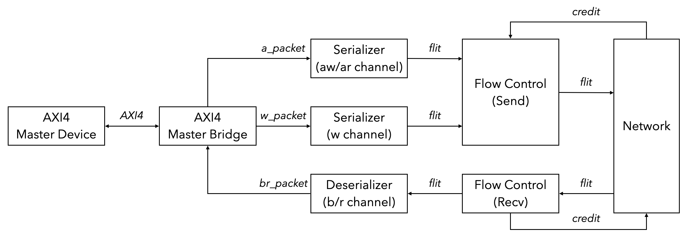
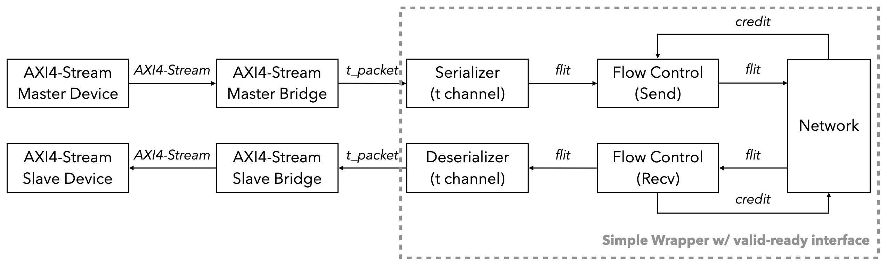
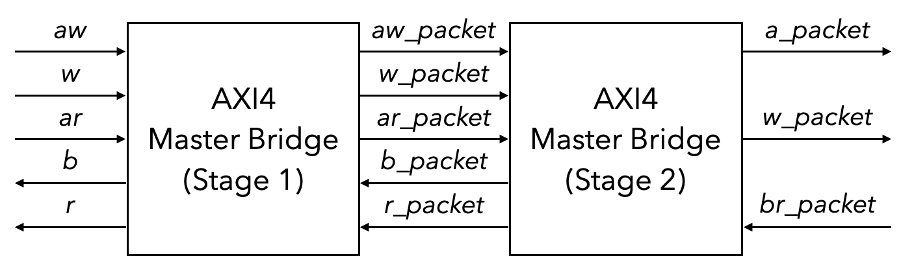
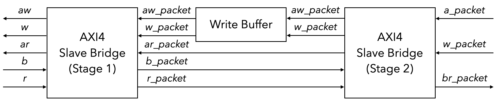
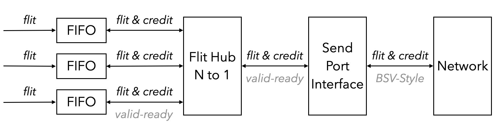

# Overview

The AXI4 wrapper is built over the [CONNECT](https://research.ece.cmu.edu/calcm/new_connect/connect/) NoC, which is a network generator targeting FPGA. The wrapper supports the following protocols.

- AXI4

- AXI4-Lite

- AXI4-Stream

- Simple packet with valid-ready interface

# Getting Started

## Build The Chisel Wrapper

Clone the wrapper repository and build. `PROTOCOL` can be `AXI4`, `AXI4-Lite`, `AXI4-Stream` or `Simple`. Note that this repository already contains a sample network with 4 send ports and 4 receive ports.

```bash
$ git clone https://github.com/shili2017/CONNECT-AXI.git
$ cd CONNECT-AXI
$ git submodule update --init --recursive
$ make PROTOCOL=<PROTOCOL>
```

Before using the network, routing tables are required to be created manually, but can also be generated by CONNECT. For example, for the given sample network, create the following four files.

1. `double_ring_4RTs_3VCs_4BD_34DW_SepIFRoundRobinAlloc_routing_0.hex`

    ```
    0
    1
    1
    2
    ```

1. `double_ring_4RTs_3VCs_4BD_34DW_SepIFRoundRobinAlloc_routing_1.hex`

    ```
    2
    0
    1
    1
    ```

1. `double_ring_4RTs_3VCs_4BD_34DW_SepIFRoundRobinAlloc_routing_2.hex`

    ```
    2
    2
    0
    1
    ```

1. `double_ring_4RTs_3VCs_4BD_34DW_SepIFRoundRobinAlloc_routing_3.hex`

    ```
    1
    1
    1
    0
    ```

Then run the regression test for all the protocols.

```bash
$ make test
```

## Build The Network (Optional)

Clone the CONNECT repository and build a network.

```bash
$ git clone https://github.com/crossroadsfpga/connect.git
$ cd connect
$ python gen_network.py -t double_ring -w 38 -n 4 -v 2 -d 4 --gen_rtl
```

The network will be generated and put in the `build` directory. To change (a) flit width or (b) number of virtual channels or (c) flit buffer depth, re-generate the network.

```bash
$ python gen_network.py -t double_ring -w <flit_width> -n 4 -v <num_vcs> -d <flit_buffer_depth> --gen_rtl
```

To put the network in the chisel wrapper, remove all redundant files and test bench files, and

```bash
$ cat *.v > mkNetwork.v
```

Add the following macro to the beginning of generated verilog code.

```verilog
`define BSV_POSITIVE_RESET
```

Then copy the network into `src/main/resources/vsrc` and copy the routing tables with `.hex` suffix to the working directory. Also emember to change the corresponding parameters in the chisel wrapper.

# Configs

To customize the wrapper, modify the configurations in `Config.scala`.

## CONNECT Network Config

These parameters need to be consistent with the generated CONNECT NoC. AXI4[-Lite] protocol requires at least 3 virtual channels to avoid deadlocks, but there's no limitations for other protocols.

```scala
class ConnectConfig
    extends Config((site, here, up) => {
      case NUM_USER_SEND_PORTS  => 4
      case NUM_USER_RECV_PORTS  => 4
      case NUM_VCS              => 3
      case REAL_FLIT_DATA_WIDTH => 34
      case FLIT_BUFFER_DEPTH    => 4

      // ...
    })
```

## Protocol & Library Config

These parameters can be customized by users.

```scala
class AXI4WrapperConfig
    extends Config((site, here, up) => {
      case PROTOCOL           => "AXI4"
      case NUM_MASTER_DEVICES => site(NUM_USER_SEND_PORTS) / 2
      case NUM_SLAVE_DEVICES  => site(NUM_USER_RECV_PORTS) / 2
      case WRITE_INTERLEAVE   => true
      case AXI4_MAX_BURST_LEN => 16
    })

// ...

class LibraryConfig
    extends Config((site, here, up) => {
      case USE_FIFO_IP => true
      case ALTERA_MF_V => "/afs/ece.cmu.edu/support/altera/release/pro-19.3.0.222/quartus/eda/sim_lib/altera_mf.v"
    })
```

# Requiments on Network

The Noc in the wrapper can be replaced by another in the future, and the wrapper requires the network to 

- Support virtual channels for AXI4 and AXI4-Lite (at least 3 VCs)

- Maintain in-order transfer between sources and sinks

- Be credit-based for flow control

- Is possible to convert to a valid-ready flit interface

However, the network can still

- Arbitrarily interleave flits as long as they are in-order

- Be in any kind of topology

- Support any width of flit data width

# Programmer's Manual

The overall design is shown in the following diagrams.


_AXI4 wrapper block diagram (master device side)_


_AXI4-Stream wrapper block diagram_

## AXI4[-Stream] Bridge

An AXI4 bridge is used to convert the protocol channels into coressponding packets. For example, for an AXI4 master bridge, it converts 5 AXI4[-Lite] channels into packets in 3 virtual channels (aw/ar channel to `a_packet` in VC 2, w channel to `w_packet` in VC 1, and b/r channel to `br_packet` in VC 0). For an AXI4-Stream master bridge, it converts the t channel into `t_packet` and put into VC 0.

AXI4 bridge is further split into 2 stages. The first stage converts 5 channels into 5 packet outputs, and the second stage contains an arbiter, as shown below. It supports reading and writing at the same time, which are handled by two seprate state machines. The arbiter is set to be round-robin at default.


_Two stages of AXI4 master bridge_

The original AXI4 protocol doesn't support transfer-level write interleaving. To support write packet interleaving, set `WRITE_INTERLEAVE` to `true` and set a proper `AXI4_MAX_BURST_LEN`. A write buffer in the slave bridge between stage 1 and stage 2 will be created to handle incoming interleaving write packets and transfer the packets according to current destination.


_Write buffer between stage 1 and 2 to store interleaving write packets_

Parameters of AXI4[-Stream] protocol can be adjusted in `AXI4.scala`. Each AXI4[-Stream] request and response is encoded in a single AXI4[-Stream] packet, or the packet can be decoded to be an AXI4[-Stream] request or response, related functions in `AXI4Packet.scala`. For example, the following code snippet shows the encoding and decoding of AXI4 or AXI4-Lite write channel packet.

```scala
// Encode
object AXI4ChannelW2PacketData {
  def apply[C <: AXI4LiteChannelW](w: C): UInt = {
    if (w.getClass == classOf[AXI4ChannelW]) {
      val w_ = w.asInstanceOf[AXI4ChannelW]
      Cat(
        w_.strb,
        w_.data,
        w_.last.asUInt,
        AXI4ChannelID.W
      )
    } else {
      Cat(
        w.strb,
        w.data,
        AXI4ChannelID.W
      )
    }
  }
}

// Decode
object Packet2AXI4ChannelW {
  def apply(packet: UInt)(implicit p: Parameters): AXI4LiteChannelW = {
    assert(packet.getWidth == p(PACKET_WIDTH))
    if (p(PROTOCOL) == "AXI4") {
      val w = Wire(new AXI4ChannelW)
      w.strb := packet(
        3 + AXI4Parameters.AXI4DataWidth + AXI4Parameters.AXI4DataWidth / 8,
        4 + AXI4Parameters.AXI4DataWidth
      )
      w.data := packet(3 + AXI4Parameters.AXI4DataWidth, 4)
      w.last := packet(3).asBool
      w
    } else {
      val w = Wire(new AXI4LiteChannelW)
      w.strb := packet(
        2 + AXI4Parameters.AXI4DataWidth + AXI4Parameters.AXI4DataWidth / 8,
        3 + AXI4Parameters.AXI4DataWidth
      )
      w.data := packet(2 + AXI4Parameters.AXI4DataWidth, 3)
      w
    }
  }
}
```

## Serializer & Deserializer

Usually the size of AXI4 protocol packets or customized user packets is larger than flit data width. In such circumstance, we need a serializer and deserializer to convert between large packets and small flits. A serializer cuts a packet into small flits with the user-defined size and send to the network, while a deserializer receives flits from the network and reassembles to packets and send to the user device.

In the case that multiple master devices send data to a single slave device, flits that arrives at the deserializer may interleave when virtual link is disabled in CONNECT network or in other NoCs. As the flits are always transferred in-order, and we know the number of send ports, we simply allocate a table with one row per source ID and fill the table with successive flits until the tail flit arrives, at which the flits are reassembled into a packet. If packets from multiple sources are ready, a priority encoder is implemented to decide which packet to send to output.

If Intel FIFO IP exists, user may set `USE_FIFO_IP` to `true` and set the corresponding library path. A `dcfifo` will be created in the serializer and deserializer, acting as the boundary of slow clock domain for FPGA logics and fast clock domain for hard NoC.

## Flow Control Layer

Credit-based flow control is supported in CONNECT and the wrapper. To support flow control, a synchronous FIFO, e.g., `SCFIFO` or chisel queue, is included as a buffer in each virtual channel between the user device and the network. On the sender side, we need to maintain a credit counter. Each time we send a flit, we need to decrement the counter, and each time we receive a credit from the network, we increment the counter. On the receiver side, each time we dequeue a flit from the FIFO to the user device, we send a credit to the network. After the FIFO, we implement a N-to-1 hub on the sender side and a 1-to-N hub on the receiver side. Finally a send/recv port interface converter is implemented to convert valid-ready interface into BSV-style interface.


_Flow control layer on the sender side with 3 virtual channels_
